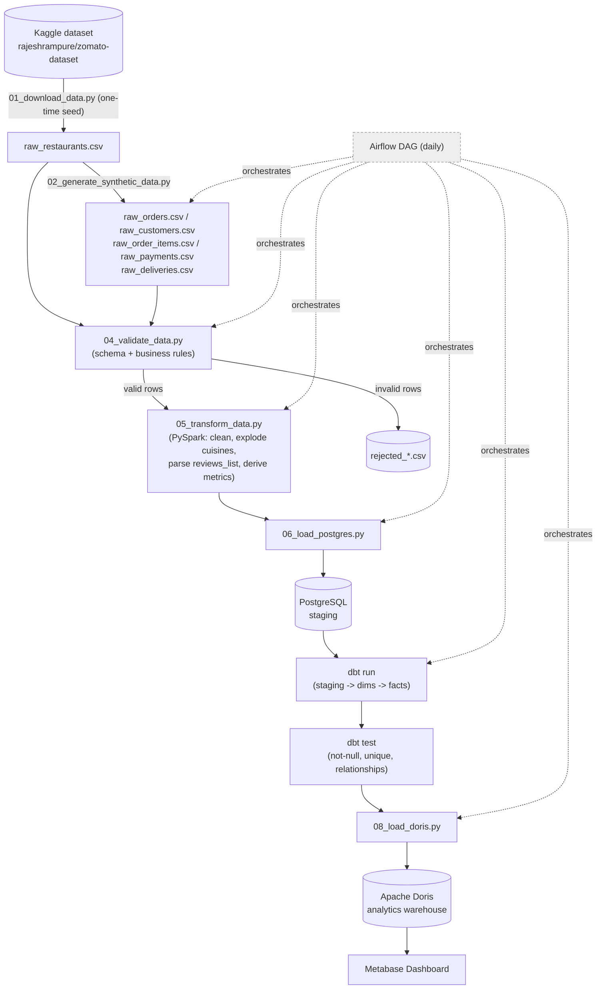

# Zomato Analytics ETL — Project Overview

## What we're building

A local, fully-free end-to-end data platform for a Zomato-style food-delivery business.
Real restaurant data (Kaggle) is combined with synthetic transactional data
(orders, customers, payments, deliveries) anchored to real restaurant signals,
cleaned and enriched in PySpark, staged in Postgres, modeled into a star schema
with dbt, served from Apache Doris, and visualized in Metabase — all orchestrated
daily by Airflow.

No AWS/GCP/Azure/Snowflake. Everything runs locally via Docker.

## Pipeline flow



## Steps in the data engineering project

Each step below names the exact file that implements it, so you can trace
"what does this step actually run" while learning the codebase.

- **Step 1: Data Acquisition** — `01_download_data.py`
  Downloads the real Zomato Bangalore restaurant dataset from Kaggle
  (`rajeshrampure/zomato-dataset`) via `kagglehub`. One-time seed step, not part
  of the daily run.
- **Step 2: Synthetic Data Generation** — `02_generate_synthetic_data.py`
  Generates customers, orders, order items, payments, and deliveries with
  Faker, anchored to real restaurant signals (rating, votes, cost-for-two) so
  volumes/values stay plausible.
- **Step 3: Data Profiling** — `03_profile_data.py`
  Run once (manually, not part of the daily DAG) before validation rules are
  written, to inspect nulls per column, encoding issues, malformed
  `rate`/`approx_cost` values, and duplicate keys — so Step 4's rules are based
  on the data's actual mess, not assumptions.
- **Step 4: Data Validation** — `04_validate_data.py`
  Enforces an explicit schema and business rules (no negative amounts, no
  orphaned restaurant IDs, valid timestamps/ratings). Valid rows pass through;
  invalid rows are quarantined with a reason code instead of dropped or
  crashed on.
- **Step 5: Data Transformation** — `05_transform_data.py`
  PySpark job that cleans types, explodes multi-value fields (`cuisines`,
  `rest_type`), parses `reviews_list` into real review rows, and derives
  metrics (order_total, delivery_time, customer_order_count, etc.).
- **Step 6: Load to Staging** — `06_load_postgres.py`
  Loads cleaned/transformed data into PostgreSQL as the operational staging
  layer.
- **Step 7: Data Modeling** — `dbt_project/` (`dbt run`, `dbt test`)
  Builds the star schema on top of staging (staging models → dimensions →
  facts) and runs dbt tests (not-null, unique, relationships) as a quality gate.
- **Step 8: Load to Warehouse** — `08_load_doris.py`
  Loads the modeled star schema into Apache Doris, the analytics warehouse
  that actually serves BI queries.
- **Step 9: Orchestration** — `09_dag.py`
  A single Airflow DAG that calls Steps 2, 4, 5, 6, 7, and 8 in order, daily.
  (Step 1 and Step 3 are one-time/manual, so they're intentionally not in the DAG.)
- **Step 10: Visualization** — Metabase (no `.py` file — configured through the
  Metabase UI, connected directly to Apache Doris).
- **Step 11: Monitoring** — `04_validate_data.py` appends its rejection
  counts/rate to Postgres (`pipeline_validation_runs`) on every run; a small
  helper, `07_record_dbt_test_results.py`, does the same for `dbt test`
  results (`pipeline_dbt_test_runs`) since dbt doesn't persist its own pass/fail
  counts anywhere queryable. Both feed the Pipeline Health dashboard page.

### Step → file quick reference

| Step | File | Runs in daily DAG? |
|---|---|---|
| 1. Data Acquisition | `01_download_data.py` | No — one-time seed |
| 2. Synthetic Data Generation | `02_generate_synthetic_data.py` | Yes |
| 3. Data Profiling | `03_profile_data.py` | No — manual, done once up front |
| 4. Data Validation | `04_validate_data.py` | Yes |
| 5. Data Transformation | `05_transform_data.py` | Yes |
| 6. Load to Staging | `06_load_postgres.py` | Yes |
| 7. Data Modeling | `dbt_project/` | Yes |
| 8. Load to Warehouse | `08_load_doris.py` | Yes |
| 9. Orchestration | `09_dag.py` | (this *is* the DAG) |
| 10. Visualization | Metabase (no file) | No — always-on, reads live from Doris |
| 11. Monitoring | `04_validate_data.py` + `07_record_dbt_test_results.py` | Yes (passive) |

## Tech stack

| Layer | Technology | Role |
|---|---|---|
| Language | Python | All scripts |
| Real data source | Kaggle (`rajeshrampure/zomato-dataset`) via `kagglehub` | Restaurant dimension data |
| Synthetic data | Faker | Customers, orders, order items, payments, deliveries |
| Transform | PySpark | Cleaning, validation support, enrichment |
| Staging store | PostgreSQL | Landing zone for cleaned data |
| Warehouse modeling | dbt Core | Builds star schema, runs data tests |
| Analytics warehouse | Apache Doris | Final star-schema tables, serves BI queries |
| Orchestration | Apache Airflow | Daily DAG tying every step together |
| Dashboard | Metabase | BI layer on top of Doris |
| Containers | Docker / Docker Compose | Runs Postgres, Airflow, Doris, Metabase locally |
| Version control | Git + GitHub | |

## Dashboard wireframe

```text
═══════════════════════════════════════════════════════════
 PAGE 1 — BUSINESS OVERVIEW
═══════════════════════════════════════════════════════════
 Orders          Revenue          Avg Order Value    Active Restaurants
 1.24M           ₹8.7Cr           ₹702                8,412
───────────────────────────────────────────────────────────
 Revenue Trend (daily)
 ████████████████████████████▁▁▁▁

 Orders by Area (Bangalore neighborhoods)
 Koramangala     ███████████
 Indiranagar     █████████
 BTM Layout      ████████
 Whitefield      ██████

 Top Cuisines by Order Volume
 North Indian    ████████████
 Chinese         █████████
 South Indian    ███████
 Fast Food       █████

 Top Restaurants
 Restaurant        Orders     Revenue
 Restaurant A       18,420    ₹24.3L
 Restaurant B       16,821    ₹21.8L
 Restaurant C       14,921    ₹19.4L

═══════════════════════════════════════════════════════════
 PAGE 2 — CUSTOMER INSIGHTS
═══════════════════════════════════════════════════════════
 Total Customers   New (30d)   Repeat Rate    Avg Orders/Customer
 184K              12,340      41%             6.7

 Customer Value Tiers (by lifetime spend)
 High value   ████ 8%   →  contributes 34% of revenue
 Mid value    ████████████ 46%
 Low value    ██████████ 46%

 Orders by Payment Method
 UPI          ████████████████
 Card         ██████████
 Cash on Del. ██████
 Wallet       ███

═══════════════════════════════════════════════════════════
 PAGE 3 — DELIVERY & OPERATIONS
═══════════════════════════════════════════════════════════
 Avg Delivery Time   Cancellation Rate   Avg Rating   On-Time %
 31 min              4.7%                4.2          88%

 Order Volume by Hour of Day
 12pm ██████████
 1pm  ████████████████
 8pm  ██████████████████
 9pm  █████████████████

 Delivery Partner Leaderboard
 Partner        Deliveries   Avg Time   Rating
 Partner A       4,210        27 min     4.6
 Partner B       3,880        33 min     4.3

 Online-Order-Enabled vs Not
 Online order = Yes   → ₹812 avg order, 31 min avg delivery
 Online order = No    → ₹640 avg order, n/a (pickup only)

═══════════════════════════════════════════════════════════
 PAGE 4 — PIPELINE HEALTH (meta/ops)
═══════════════════════════════════════════════════════════
 Rows Ingested Today   Rejected Rows   Rejection Rate   dbt Tests
 42,180                 216             0.51%            38/38 passed
```

## Folder structure

Kept intentionally flat — one small script per pipeline step, no nested package layout.
The only exception is `dbt_project/`, whose internal folder layout (`models/`, `tests/`) is
required by dbt itself.

```
zomato-etl/
├── 01_download_data.py             # kagglehub: pull real restaurant dataset (one-time)
├── 02_generate_synthetic_data.py   # Faker: create orders/customers/payments/deliveries
├── 03_profile_data.py              # one-time profiling pass (nulls, encoding, malformed values)
├── 04_validate_data.py             # schema + business-rule checks, quarantines bad rows
├── 05_transform_data.py            # PySpark: clean, enrich, explode cuisines, parse reviews_list
├── 06_load_postgres.py             # load cleaned data into Postgres staging tables
├── 07_record_dbt_test_results.py   # records dbt test pass/fail for the health dashboard
├── 08_load_doris.py                # load dbt-built star schema into Apache Doris
├── 09_dag.py                       # single Airflow DAG wiring the steps above
├── dbt_project/                    # dbt's required internal structure (models/, tests/)
├── data/                           # flat data folder — raw_*.csv, rejected_*.csv, etc.
├── Dockerfile                      # ad-hoc script image (PySpark + JVM)
├── Dockerfile.airflow              # Airflow image: apache/airflow + JVM + dbt + scripts
├── docker-compose.yml              # Postgres, Doris, Airflow, Metabase
├── requirements.txt
└── README.md
```

Each `.py` file does one job and stays minimal — no shared framework/abstraction layer,
no multi-module packages. If a step needs shared logic later, we'll add it only when
duplication actually becomes a problem.
