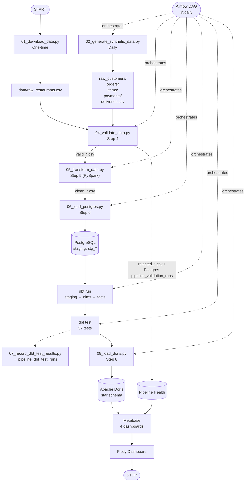
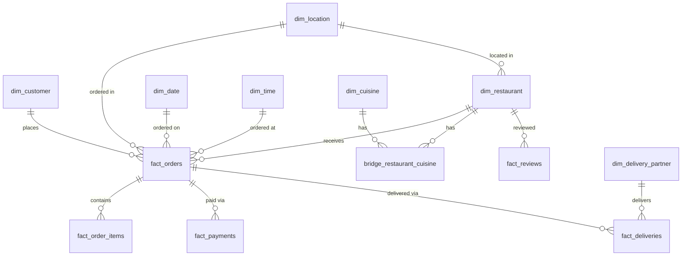

# Zomato Analytics ETL

An end-to-end, fully self-hosted analytics pipeline for a Zomato-style food-delivery business.


## Description

Real Bangalore restaurant data (51,717 restaurants from a public Kaggle dataset) is combined with synthetic daily transactions (orders, payments, deliveries — generated with Faker, anchored to each restaurant's real rating/cost so volumes stay plausible). The combined data is validated, cleaned in PySpark, modeled into a star schema with dbt, loaded into an OLAP warehouse (Apache Doris), and served through Metabase dashboards — all orchestrated by a daily Apache Airflow DAG.

This exists to get hands-on, working experience with a real ELT stack (PySpark, Airflow, dbt, an OLAP warehouse) end to end, and to practice a specific lesson from a prior project: **catch bad data at the door, not at the end.** Every stage that touches raw data enforces an explicit schema and quarantines anything that fails validation instead of silently dropping or crashing on it — see [Data Quality & Testing](#data-quality--testing).

The outcome is a working pipeline that ingests real + synthetic data daily, keeps 37/37 dbt data-quality tests green, and answers real food-delivery business questions (revenue trends, customer repeat rate, delivery performance) on two interchangeable dashboards: Metabase and a custom local Plotly Dash app.

## Result

> Built an end-to-end ELT analytics pipeline (Zomato-style food delivery data) using PySpark, PostgreSQL, dbt, Apache Doris, and Airflow, processing **51.7K real restaurants** and **1.3M+ parsed reviews**; cut warehouse load time from 20+ min to **6.6s** by replacing batched `INSERT`s with native `COPY`/Stream Load, and fixed a Spark memory bug that cut transform runtime by **~65%** (9 min → 2.5 min).

All 11 pipeline steps (see [Project Status](#run-it-end-to-end)) are implemented, wired into Airflow, and verified with a real end-to-end run: `generate_synthetic_data → validate_data → transform_data → load_postgres → dbt run → dbt test → record_dbt_test_results → load_doris`, all green, ~4 minutes end to end.

## Where to start

**Read in this order:**


| # | Document                                             | For                                                                     |
| --- | ------------------------------------------------------ | ------------------------------------------------------------------------- |
| 1 | [`doc/WALKTHROUGH.md`](doc/WALKTHROUGH.md)           | Run every script yourself, step by step, with expected output           |
| 2 | [`doc/PROJECT_OVERVIEW.md`](doc/PROJECT_OVERVIEW.md) | Understand the system design and architecture rationale                 |
| 3 | [`doc/PRD.md`](doc/PRD.md)                           | Read the original requirements/data dictionary and what was implemented |
| 4 | [`doc/FLOWCHART.md`](doc/FLOWCHART.md)               | Every pipeline step in depth, with a diagram and real code for each     |
| 5 | [`doc/DASHBOARD.md`](doc/DASHBOARD.md)               | Understand what every chart on every dashboard page means               |
| 6 | [`doc/VIDEO.md`](doc/VIDEO.md)                       | Curated videos for any tool/concept here you haven't used before        |

> The rest of this README is the summary: features, architecture, build steps, usage, and the data model.

---

## Table of Contents

- [Zomato Analytics ETL](#zomato-analytics-etl)
  - [Description](#description)
  - [Result](#result)
  - [Where to start](#where-to-start)
  - [Table of Contents](#table-of-contents)
  - [What problem this solves](#what-problem-this-solves)
  - [Concepts you need (read this first)](#concepts-you-need-read-this-first)
  - [How the whole thing fits together](#how-the-whole-thing-fits-together)
  - [Tech stack](#tech-stack)
  - [Features](#features)
  - [Architecture](#architecture)
  - [UML diagrams](#uml-diagrams)
  - [Repository map](#repository-map)
  - [Folder structure](#folder-structure)
  - [Requirements](#requirements)
  - [Setup](#setup)
  - [Environment variables](#environment-variables)
  - [Getting free API keys](#getting-free-api-keys)
  - [The data model](#the-data-model)
  - [Data Quality \& Testing](#data-quality--testing)
  - [Run it end to end](#run-it-end-to-end)
  - [Run locally](#run-locally)
  - [Demo](#demo)
  - [Every script, explained](#every-script-explained)
  - [Reading the results](#reading-the-results)
  - [Results](#results)
  - [Build steps](#build-steps)
  - [Roadmap](#roadmap)
  - [Lessons learned](#lessons-learned)
  - [Troubleshooting](#troubleshooting)
  - [Extending the project](#extending-the-project)
  - [Glossary](#glossary)
  - [Documentation](#documentation)

---

## What problem this solves

Two problems, really:

1. **Learning problem.** The goal was hands-on, working experience with PySpark, Airflow, dbt, and an OLAP warehouse — not just reading about them. Every architectural choice (e.g. Doris over Snowflake, dbt-postgres instead of the unverified `dbt-doris` adapter) was made to maximize real learning while staying on free, self-hosted tooling.
2. **The "bad data at the end" failure mode.** A prior project of the user's broke down late because bad data flowed downstream undetected. This project front-loads data quality instead: explicit schemas everywhere (never blind `inferSchema`), a quarantine file with a reason code for every rejected row, and a hard rejection-rate gate that fails the run loudly rather than continuing silently. See [Data Quality & Testing](#data-quality--testing).

## Concepts you need (read this first)

If you're new to data engineering, these five ideas explain most of the design decisions below:

- **ETL vs. ELT** — this project is ELT: raw data is **L**oaded into Postgres staging first, then **T**ransformed into the final star schema by dbt, rather than transforming everything before it lands anywhere.
- **Staging vs. warehouse** — Postgres holds the *staging* tables (`stg_*`, a straight mirror of the latest cleaned CSVs). dbt builds the actual star schema (dims/facts) on top of staging, in Postgres too. Apache Doris is the *analytics warehouse* — a copy of the finished star schema, optimized for the fast aggregate queries a BI dashboard needs.
- **Star schema** — one central **fact** table per business event (an order, a delivery, a payment, a review), surrounded by **dimension** tables (customer, restaurant, date, ...) that describe the "who/what/when" of each fact. See [The data model](#the-data-model).
- **DAG / orchestration** — a DAG (Directed Acyclic Graph) is just "a set of steps with dependencies between them." Airflow runs this project's DAG once a day, running each script in the right order and re-running only what's needed.
- **Data quality gate** — a validation step that can *fail the whole run* if too much data looks wrong, instead of letting bad rows quietly flow into the warehouse. See [Data Quality & Testing](#data-quality--testing).

More terms are in the [Glossary](#glossary).

## How the whole thing fits together



`01_download_data.py` (Step 1) and `03_profile_data.py` (Step 3) are one-time/manual — not part of the daily DAG.

## Tech stack


| Layer                | Technology                           | Notes                                                |
| ---------------------- | -------------------------------------- | ------------------------------------------------------ |
| Language             | Python 3.11                          | 3.12 breaks PySpark 3.5.3 workers on Windows         |
| Real data source     | Kaggle`rajeshrampure/zomato-dataset` | via`kagglehub`, one-time seed                        |
| Synthetic data       | Faker                                | orders, customers, order items, payments, deliveries |
| Transform            | PySpark 3.5.3                        | runs inside the`airflow` container (bundled JVM)     |
| Staging store        | PostgreSQL 16                        | port`5439` on host                                   |
| Warehouse modeling   | dbt Core 1.8.8 (`dbt-postgres`)      | builds star schema directly in Postgres              |
| Analytics warehouse  | Apache Doris (`all-in-one` image)    | FE+BE in one container; serves BI queries            |
| Orchestration        | Apache Airflow 3.3.1 (`standalone`)  | LocalExecutor, SQLite metadata (not persisted)       |
| Dashboard            | Metabase                             | port`3030` on host                                   |
| Alternative frontend | Dash 2.18.2 + Plotly                 | standalone local app, not containerized              |
| Containers           | Docker / Docker Compose              | 4 services: postgres, doris, airflow, metabase       |
| Version control      | Git + GitHub                         |                                                      |

Full rationale for each choice (why Doris over Snowflake, why dbt over Great Expectations, etc.) is in [`doc/PROJECT_OVERVIEW.md`](doc/PROJECT_OVERVIEW.md).

## Features

- Automated daily ingestion of synthetic transactional data, anchored to real restaurant popularity/cost signals so volumes stay realistic
- Explicit-schema, defensive validation on every raw table, with a quarantine file (`rejected_*.csv` + `reject_reason`) and a hard rejection-rate gate
- PySpark transformation: type cleaning, explode of multi-valued `cuisines`, and a UDF that parses Kaggle's real stringified `reviews_list` into actual review rows
- A dbt-built star schema (5 fact tables, 7 dimension tables, 1 bridge table) with 37 automated `not_null`/`unique`/`relationships` tests
- A full daily Airflow DAG wiring generation → validation → transform → load → model → test → warehouse-load into one run
- Two interchangeable dashboards over the same data: 4-page Metabase BI dashboard, and a standalone Zomato-branded Plotly Dash app
- A "Pipeline Health" page fed by the pipeline's own run metadata (rejection rates, dbt test pass rates over time) — the pipeline monitors itself

## Architecture

- **Ingestion** — `01_download_data.py` pulls the real Kaggle dataset once; `02_generate_synthetic_data.py` generates one new simulated day of orders/items/payments/deliveries every run, weighted by each restaurant's real rating/vote count/cost.
- **Validation** — `04_validate_data.py` is the single quality gate all raw data passes through before anything downstream sees it. It reads explicit schemas, applies business rules (no orphaned foreign keys, no negative amounts, no duplicate keys), and quarantines failures instead of dropping them.
- **Transformation** — `05_transform_data.py` (PySpark) is where the messy real-world columns actually get cleaned: `rate`/`approx_cost` string parsing, `cuisines` explode into a bridge table, and a regex+`ast.literal_eval`-based parser that turns Kaggle's `reviews_list` string into real `fact_reviews` rows.
- **Staging** — `06_load_postgres.py` bulk-loads the cleaned CSVs into Postgres via `COPY`, replacing each `stg_*` table on every run (staging always mirrors the latest clean data — no incremental merge logic).
- **Modeling** — `dbt_project/` builds the star schema (dims → facts) on top of staging and runs the 37 data tests. `dbt-postgres`, not `dbt-doris`, builds the schema — see [Lessons learned](#lessons-learned) for why.
- **Warehouse load** — `08_load_doris.py` exports each finished star-schema table from Postgres and ingests it into Doris via Stream Load (Doris's bulk HTTP ingest API), replacing row-by-row `INSERT`, which is an anti-pattern for an OLAP engine.
- **Orchestration** — `09_dag.py` is a single Airflow DAG (`zomato_analytics_pipeline`, `@daily`) wiring generation → validation → transform → staging load → dbt run/test → result recording → warehouse load, in dependency order.
- **Presentation** — Metabase queries Doris directly for the 3 business-facing dashboard pages, and Postgres for the Pipeline Health page (that monitoring data isn't part of the star schema). `10_dash_dashboard.py` is a standalone alternative that reads the same two sources.

External dependencies: the Kaggle API (one-time, needs free credentials — see [Getting free API keys](#getting-free-api-keys)); everything else is self-hosted via Docker, with no other external service calls.

## UML diagrams

Star-schema entity relationships, as enforced by `dbt_project/models/schema.yml`'s 37 `relationships` tests:



The full pipeline flowchart (ingestion → validation → transform → warehouse) is in [How the whole thing fits together](#how-the-whole-thing-fits-together) above; a step-by-step version with code for each box is in [`doc/FLOWCHART.md`](doc/FLOWCHART.md).

## Repository map

Kept flat by design — one small script per pipeline step, numbered in execution order, no `src/`-style package layout. The only exception is `dbt_project/`, whose internal layout (`models/`, `target/`) is required by dbt itself.

## Folder structure

```
data etl/
├── 01_download_data.py             # Step 1 — one-time Kaggle download
├── 02_generate_synthetic_data.py   # Step 2 — Faker-generated daily transactions
├── 03_profile_data.py              # Step 3 — one-time manual data profiling
├── 04_validate_data.py             # Step 4 — schema/business-rule validation + quarantine
├── 05_transform_data.py            # Step 5 — PySpark cleaning, explode, review parsing
├── 06_load_postgres.py             # Step 6 — bulk COPY into Postgres staging tables
├── 07_record_dbt_test_results.py   # records dbt test pass/fail to Postgres for Step 11
├── 08_load_doris.py                # Step 8 — Stream Load star schema into Doris
├── 09_dag.py                       # Step 9 — single Airflow DAG wiring steps 2,4-8
├── 10_dash_dashboard.py            # standalone local Plotly Dash frontend (not in the DAG)
├── assets/                         # Dash static assets (the Zomato logo SVG)
├── dbt_project/                    # Step 7 — dbt models (dims/facts) + tests
│   ├── dbt_project.yml
│   ├── profiles.yml
│   └── models/
│       ├── sources.yml             # declares Postgres stg_* tables as dbt sources
│       ├── schema.yml              # not_null/unique/relationships tests
│       ├── dims/                   # dim_restaurant, dim_location, dim_cuisine,
│       │                           # dim_customer, dim_delivery_partner, dim_date,
│       │                           # dim_time, bridge_restaurant_cuisine
│       └── facts/                  # fact_orders, fact_order_items, fact_deliveries,
│                                    # fact_payments, fact_reviews
├── Dockerfile                      # image for ad-hoc script runs (PySpark + JVM)
├── Dockerfile.airflow              # Airflow image: apache/airflow + JVM + dbt + scripts
├── docker-compose.yml              # postgres, doris, airflow, metabase services
├── requirements.txt
├── .env.example                    # template for every env var the scripts read
├── data/                           # gitignored — raw/valid/rejected/clean CSVs
├── doc/                            # all other docs — see Documentation below
├── CLAUDE.md                       # hard constraints for AI-assisted work in this repo
└── README.md                       # this file
```

Every step's script, with a diagram and real code excerpt, is explained in full in [`doc/FLOWCHART.md`](doc/FLOWCHART.md).

## Requirements

- **Docker Desktop**, with at least ~6–8 GB memory allocated (running Postgres + Doris + Airflow's Spark job + Metabase together is memory-heavy — see [Troubleshooting](#troubleshooting))
- **Python 3.11** — only needed if running scripts directly on the host outside Docker (Python 3.12 crashes PySpark workers on Windows); not needed for the Airflow/Docker path
- **Kaggle API credentials** for the one-time dataset download — see [Getting free API keys](#getting-free-api-keys)
- No other external services or paid API keys are used anywhere in this project

Full command-by-command setup is next.

## Setup

```bash
# 1. Create and activate a Python 3.11 virtual environment
python -m venv .venv
.venv/Scripts/activate        # Windows
# source .venv/bin/activate   # macOS/Linux

# 2. Install dependencies
pip install -r requirements.txt

# 3. One-time: download the real Kaggle dataset
python 01_download_data.py

# 4. One-time (optional but recommended): profile the raw data before trusting
#    04_validate_data.py's rules
python 03_profile_data.py

# 5. Bring up the infrastructure
docker compose up -d
```

`docker compose up -d` starts 4 services: `postgres`, `doris`, `airflow` (builds from `Dockerfile.airflow` on first run), and `metabase`. Wait for all four to report healthy:

```bash
docker compose ps
```


| Service  | Host port(s)                                                              | Purpose                                                                                               |
| ---------- | --------------------------------------------------------------------------- | ------------------------------------------------------------------------------------------------------- |
| postgres | `5439` → 5432                                                            | Staging store                                                                                         |
| doris    | `8030` (FE HTTP), `9030` (MySQL protocol), `8040` (BE HTTP / Stream Load) | Analytics warehouse                                                                                   |
| airflow  | `8080`                                                                    | Airflow UI (`standalone` mode; admin password printed to `docker compose logs airflow` on first boot) |
| metabase | `3030` → 3000                                                            | BI dashboard UI                                                                                       |

## Environment variables

All scripts default to the values `docker-compose.yml` sets for inter-container networking, and fall back to host-side defaults (matching the mapped ports) when run locally outside Docker. Override via a `.env` file (gitignored — copy `.env.example`) or real environment variables — never commit real credentials.


| Variable                                              | Default (local/.env)                        | Default (inside`airflow` container) |
| ------------------------------------------------------- | --------------------------------------------- | ------------------------------------- |
| `POSTGRES_HOST`                                       | `localhost`                                 | `postgres`                          |
| `POSTGRES_PORT`                                       | `5439`                                      | `5432`                              |
| `POSTGRES_DB` / `POSTGRES_USER` / `POSTGRES_PASSWORD` | `zomato`                                    | `zomato`                            |
| `DORIS_HOST`                                          | `localhost`                                 | `doris`                             |
| `DORIS_QUERY_PORT`                                    | `9030`                                      | `9030`                              |
| `DORIS_STREAM_LOAD_PORT`                              | `8040`                                      | `8040`                              |
| `DORIS_USER` / `DORIS_PASSWORD`                       | `root` / *(empty)*                          | `root` / *(empty)*                  |
| `DBT_PROFILES_DIR`                                    | `dbt_project` (pass `--profiles-dir`)       | `/opt/project/dbt_project`          |
| `KAGGLE_USERNAME` / `KAGGLE_KEY`                      | *(unset — or use `~/.kaggle/kaggle.json`)* | not needed (Step 1 is host-only)    |

Real running credentials (as opposed to the defaults above) are documented in [`doc/PASSWORD.md`](doc/PASSWORD.md) (gitignored, never pushed).

## Getting free API keys

Only **one** external credential is needed anywhere in this project, and it's free:

- **Kaggle API key**, for `01_download_data.py`'s one-time dataset download. Create a free Kaggle account, go to *Account → API → Create New Token*, and either:
  - place the downloaded `kaggle.json` at `~/.kaggle/kaggle.json`, or
  - set `KAGGLE_USERNAME` and `KAGGLE_KEY` as environment variables (or in `.env`).

Every other service (Postgres, Doris, Airflow, Metabase) is self-hosted via Docker with no external account or key required.

## The data model

**Fact tables**


| Table              | Grain                                                        |
| -------------------- | -------------------------------------------------------------- |
| `fact_orders`      | one row per order                                            |
| `fact_order_items` | one row per order line item                                  |
| `fact_deliveries`  | one row per delivery                                         |
| `fact_payments`    | one row per payment                                          |
| `fact_reviews`     | one row per parsed review (from Kaggle's real`reviews_list`) |

**Dimension tables**

`dim_customer`, `dim_restaurant`, `dim_delivery_partner`, `dim_location`, `dim_date`, `dim_time`, `dim_cuisine` + `bridge_restaurant_cuisine` (many-to-many restaurant↔cuisine).

Geography uses `dim_location.area` (Bangalore neighborhood), **not** a fake multi-city field — the Kaggle dataset's `listed_in(city)` column is a scrape-region label within Bangalore only. See [`CLAUDE.md`](CLAUDE.md) for this and other known data-shape gotchas.

Full data dictionary (raw Kaggle column → star-schema column mapping) is in [`doc/PRD.md`](doc/PRD.md#53-data-dictionary--raw-kaggle-columns--star-schema). See [UML diagrams](#uml-diagrams) above for the entity-relationship diagram.

## Data Quality & Testing

Data quality is front-loaded, not bolted on (see [`CLAUDE.md`](CLAUDE.md)):

- **`04_validate_data.py`** enforces explicit business rules (missing keys, orphaned foreign keys, non-positive amounts, duplicates) on every raw file. Invalid rows are quarantined to `data/rejected_*.csv` with a `reject_reason` column instead of being silently dropped. The pipeline **fails loudly** (`sys.exit(1)`) if any entity's rejection rate exceeds 2%.
- **dbt tests** (37 total, in `dbt_project/models/schema.yml`): `not_null` and `unique` on every primary key, `relationships` on every foreign key across all dims, the bridge table, and facts.
- Both feed the **Pipeline Health** dashboard: `04_validate_data.py` appends a row to `pipeline_validation_runs` on every run; `07_record_dbt_test_results.py` appends to `pipeline_dbt_test_runs` after every `dbt test` — even on failure, so a bad run is visible rather than silently missing.

## Run it end to end

**Via Airflow (recommended)** — this is the "production" path:

```bash
docker compose exec airflow airflow dags unpause zomato_analytics_pipeline
```

The DAG (`@daily`, `catchup=False`) runs automatically once unpaused. To trigger it manually for today:

```bash
docker compose exec airflow airflow dags trigger zomato_analytics_pipeline
```

Check progress:

```bash
docker compose exec airflow airflow tasks states-for-dag-run \
  zomato_analytics_pipeline "scheduled__<date>T00:00:00+00:00"
```

> Airflow's `standalone` mode uses SQLite with no persisted volume — its own run history resets on every `docker compose up`/container recreate. The actual pipeline data (Postgres, Doris, `data/`) is unaffected.

Status of all 11 steps, and which run inside the daily DAG:


| Step                         | File                                                          |  Runs in daily DAG?  |
| ------------------------------ | --------------------------------------------------------------- | :---------------------: |
| 1. Data Acquisition          | `01_download_data.py`                                         |  No (one-time seed)  |
| 2. Synthetic Data Generation | `02_generate_synthetic_data.py`                               |          Yes          |
| 3. Data Profiling            | `03_profile_data.py`                                          | No (manual, one-time) |
| 4. Data Validation           | `04_validate_data.py`                                         |          Yes          |
| 5. Data Transformation       | `05_transform_data.py` (PySpark)                              |          Yes          |
| 6. Load to Staging           | `06_load_postgres.py`                                         |          Yes          |
| 7. Data Modeling             | `dbt_project/`                                                |          Yes          |
| 8. Load to Warehouse         | `08_load_doris.py`                                            |          Yes          |
| 9. Orchestration             | `09_dag.py` (Airflow)                                         |          —          |
| 10. Visualization            | Metabase (4 dashboards)                                       |    No (always-on)    |
| 11. Monitoring               | Postgres`pipeline_validation_runs` / `pipeline_dbt_test_runs` |     Yes (passive)     |

## Run locally

For debugging, each script can be run directly inside the `airflow` container, which already has the JVM, dbt, and all Python dependencies:

```bash
docker compose exec airflow bash -c "cd /opt/project && python 02_generate_synthetic_data.py --date 2026-09-05"
docker compose exec airflow bash -c "cd /opt/project && python 04_validate_data.py"
docker compose exec airflow bash -c "cd /opt/project && python 05_transform_data.py"
docker compose exec airflow bash -c "cd /opt/project && python 06_load_postgres.py"
docker compose exec airflow bash -c "cd /opt/project/dbt_project && dbt run && dbt test"
docker compose exec airflow bash -c "cd /opt/project && python 07_record_dbt_test_results.py"
docker compose exec airflow bash -c "cd /opt/project && python 08_load_doris.py"
```

Steps 1 and 3 (`01_download_data.py`, `03_profile_data.py`) are meant to be run on the host, not in a container — see [Setup](#setup).

## Demo

**Metabase** — open `http://localhost:3030` after `docker compose up -d`. Four dashboards live under **Our analytics**: Business Overview, Customer Insights, Delivery & Operations, Pipeline Health.

**Local Plotly Dash app (alternative, no Docker/login needed)** — `10_dash_dashboard.py` is a standalone frontend that reads the same Doris/Postgres tables and shows the same four pages in a custom Zomato-branded UI (red sidebar, real Zomato logo, Poppins font):

```bash
pip install dash plotly
python 10_dash_dashboard.py
# then open http://127.0.0.1:8050
```

See [`doc/DASHBOARD.md`](doc/DASHBOARD.md#alternative-frontend--the-local-plotly-dash-dashboard) for what it looks like, and [`doc/WALKTHROUGH.md`](doc/WALKTHROUGH.md) step 13 for more detail.

## Every script, explained


| Script                          | What it does                                                                                                                                                 |
| --------------------------------- | -------------------------------------------------------------------------------------------------------------------------------------------------------------- |
| `01_download_data.py`           | One-time download of the real Zomato restaurant dataset via`kagglehub`; no-ops if already downloaded                                                         |
| `02_generate_synthetic_data.py` | Generates one simulated day of customers/orders/items/payments/deliveries with Faker, weighted by real restaurant rating/votes/cost                          |
| `03_profile_data.py`            | One-time manual pass over the raw dataset (nulls, duplicate keys, malformed`rate`/`cost` values) to inform Step 4's rules                                    |
| `04_validate_data.py`           | Enforces explicit schema + business rules; quarantines invalid rows with a reason code; fails the run if rejection rate exceeds 2%; logs the run to Postgres |
| `05_transform_data.py`          | PySpark: cleans/casts types, explodes`cuisines`, parses `reviews_list` into real review rows, derives metrics                                                |
| `06_load_postgres.py`           | Bulk-loads`clean_*.csv` into Postgres staging tables via `COPY`                                                                                              |
| `07_record_dbt_test_results.py` | Reads dbt's`run_results.json` after `dbt test` and logs pass/fail counts to Postgres, even on failure                                                        |
| `08_load_doris.py`              | Exports the dbt-built star schema from Postgres and ingests it into Doris via Stream Load                                                                    |
| `09_dag.py`                     | The single Airflow DAG wiring Steps 2, 4–8 into one daily run                                                                                               |
| `10_dash_dashboard.py`          | Standalone local Plotly Dash frontend — not part of the DAG, run by hand whenever you want to look at current numbers                                       |

## Reading the results


| Dashboard page            | Highlights                                                                                                                                       |
| --------------------------- | -------------------------------------------------------------------------------------------------------------------------------------------------- |
| **Business Overview**     | Total orders/revenue/AOV/active restaurants, revenue trend, orders by area, top cuisines, top restaurants                                        |
| **Customer Insights**     | Total/new customers, repeat rate, avg orders/customer, customer value tiers, orders by payment method                                            |
| **Delivery & Operations** | Avg delivery time, cancellation rate, avg rating, on-time %, order volume by hour, delivery partner leaderboard, online-order-enabled comparison |
| **Pipeline Health**       | Rows ingested/rejected/rejection rate (latest run), dbt test pass rate, rejection rate trend                                                     |

Business Overview / Customer Insights / Delivery & Operations query **Doris** directly. Pipeline Health queries **Postgres** (`pipeline_validation_runs` / `pipeline_dbt_test_runs`), since that monitoring data isn't part of the star schema loaded into Doris. Full explanation of every chart is in [`doc/DASHBOARD.md`](doc/DASHBOARD.md).

## Results


| Metric                                                             | Value                          |
| -------------------------------------------------------------------- | -------------------------------- |
| Real restaurants processed                                         | 51,717                         |
| Real reviews parsed from`reviews_list`                             | 1.3M+                          |
| dbt data-quality tests passing                                     | 37 / 37                        |
| Warehouse load time (batched`INSERT` → native `COPY`/Stream Load) | 20+ min → 6.6s                |
| Transform runtime (after fixing a Spark memory bug)                | 9 min → 2.5 min (~65% faster) |
| Full end-to-end DAG run                                            | ~4 minutes                     |

See [Reading the results](#reading-the-results) for what these numbers actually look like on a dashboard.

## Build steps

Built incrementally, in the order the git history reflects: initial ETL scaffolding (download → validate) → PySpark transformation and Postgres staging load → dbt models and Apache Doris integration → Airflow orchestration → a round of CSV-quoting compatibility fixes across Spark/Postgres/Doris → a code-structure refactor → full project documentation (`doc/`) → the local Plotly Dash frontend → a final performance pass (the load-time and Spark-memory fixes reflected in [Results](#results)).

No separate build-plan or build-log document exists for this project — the git commit history *is* the build log.

## Roadmap

Nothing is actively planned beyond what's implemented. [`doc/PRD.md`](doc/PRD.md#10-out-of-scope--future-enhancements) explicitly scoped these out for this version; they remain possible future improvements if the project were extended:

- **Possible future improvements:**
  - Streaming ingestion (e.g. Kafka) for order events, alongside the existing daily batch generation
  - ML-based forecasting or recommendation features on top of the warehouse
  - Genuine multi-city simulation (deliberately rejected for now — the real dataset is Bangalore-only, and faking other cities would misrepresent the data)

## Lessons learned

- **Tool version compatibility is a real cost, not a footnote.** PySpark 3.5.3 silently crashes its Python workers under Python 3.12 on Windows, and needs a Java 8 JRE plus a project-local `winutils.exe`/`hadoop.dll` for any local-filesystem write — none of which surfaces until you try to actually write data. Running it inside a Linux Docker container instead sidesteps all of it.
- **"CSV" is not one format.** Postgres `COPY`, pandas, and Spark's CSV reader/writer all default to different quote-escaping conventions (doubled `"` vs. backslash-escaped `\"`), and Apache Doris's Stream Load API needs its own explicit `enclose` header. This caused two separate real bugs in this project (see [Troubleshooting](#troubleshooting)) before every boundary between tools had its escaping made explicit.
- **Avoid unverified adapters for a load-bearing step.** `dbt-doris` (community-maintained) was flagged as a risk during planning and never used — `dbt-postgres` builds the star schema instead, with a plain Stream Load script copying the finished tables into Doris. This traded a slightly less "pure" architecture for one with no unverified dependency in the critical path.
- **Batch bulk-load APIs, don't row-by-row `INSERT` into an OLAP engine.** Switching both the Postgres and Doris loaders to native bulk APIs (`COPY`, Stream Load) instead of per-row inserts cut load time from 20+ minutes to 6.6 seconds — the single biggest performance win in the project.
- **Collecting large Spark results to the driver has a real memory cost.** Materializing the 1.3M+-row reviews table via `.toPandas()` roughly doubles memory usage (JVM + Python objects held at once) and was observed to destabilize the whole Docker Desktop VM; writing it with Spark's own CSV writer instead fixed it and incidentally made the whole transform step ~65% faster.

## Troubleshooting

**PySpark on Windows (if running `05_transform_data.py` outside Docker):** PySpark 3.5.3 needs Python 3.11 (not 3.12 — worker crashes), a Java 8 JRE, and a project-local `winutils.exe`/`hadoop.dll` for any local-filesystem write. Inside the `airflow` container this is a non-issue (Linux + bundled JVM); these fixes only matter for local/native runs on Windows.

**CSV quoting mismatches between tools** — hit and fixed twice in this project, worth knowing about if you touch `05_transform_data.py` or `08_load_doris.py` again:

- Postgres's `COPY (FORMAT csv)` and pandas both follow RFC4180: an embedded quote is escaped by **doubling** it (`""`).
- Spark's CSV writer/reader **defaults to backslash-escaping** (`\"`) instead. Reading a pandas-written CSV in Spark needs `.option("escape", '"')`; writing a CSV from Spark for Postgres to `COPY` needs the same.
- Apache Doris's Stream Load API needs an explicit `enclose` header to handle quoted fields at all, and its `escape` header — if set — expects backslash escaping, which broke on review text that legitimately contains a literal backslash (e.g. `:-\` emoticons). Fixed by using `enclose` **without** `escape` in `08_load_doris.py`.

**`05_transform_data.py` memory usage:** the reviews table (1.3M+ rows) is written via Spark's own CSV writer rather than `.toPandas()` — collecting that much text through Py4J into a pandas DataFrame roughly doubles memory usage and was observed to crash the Spark JVM under memory pressure, which in turn destabilized the whole Docker Desktop VM. If you reintroduce `.toPandas()` for a large table, watch memory closely.

**Docker Desktop resource allocation:** running Postgres + Doris (JVM) + Airflow (Spark) + Metabase (JVM) simultaneously is memory-heavy. Give Docker Desktop as much memory as you reasonably can (Settings → Resources); under 7–8 GB, the whole VM can become unresponsive during `05_transform_data.py`'s review-parsing step.

**`dbt-doris` risk:** never used — the architecture avoids it entirely. `dbt-postgres` builds the star schema in Postgres; `08_load_doris.py` then copies the finished tables into Doris via Stream Load. This sidesteps the community `dbt-doris` adapter's unverified maturity, which was flagged as a risk during planning (see [`CLAUDE.md`](CLAUDE.md)).

## Extending the project

The flat, numbered-script convention is intentional (see [`CLAUDE.md`](CLAUDE.md)) — to add a new pipeline step:

1. Add a new `NN_description.py` script at the root, following the next available number.
2. If it should run daily, add a `BashOperator` task for it in `09_dag.py` and wire its dependencies (`>>`).
3. If it adds new tables, add a dbt model under `dbt_project/models/dims/` or `facts/` plus tests in `dbt_project/models/schema.yml`.
4. If it's Metabase-facing, add a new dashboard card via the Metabase UI; if it should also appear in the local frontend, add it to `10_dash_dashboard.py`.

Don't add a shared framework/abstraction layer for cross-script logic unless duplication actually becomes a real problem — see the "keep scripts minimal" constraint in [`CLAUDE.md`](CLAUDE.md).

## Glossary


| Term                    | Meaning here                                                                                                                                                                                                               |
| ------------------------- | ---------------------------------------------------------------------------------------------------------------------------------------------------------------------------------------------------------------------------- |
| **ETL / ELT**           | Extract-Transform-Load vs. Extract-Load-Transform. This project is ELT: raw data lands in Postgres staging before dbt transforms it into the star schema.                                                                  |
| **Staging table**       | A`stg_*` table in Postgres — a straight, always-latest mirror of the cleaned CSVs, with no business logic applied yet.                                                                                                    |
| **Star schema**         | A data model with fact tables (events) at the center, surrounded by dimension tables (descriptive context) they reference by foreign key.                                                                                  |
| **Fact table**          | One row per business event — e.g.`fact_orders` has one row per order.                                                                                                                                                     |
| **Dimension table**     | One row per real-world entity being described — e.g.`dim_customer` has one row per customer.                                                                                                                              |
| **DAG**                 | Directed Acyclic Graph — Airflow's term for "a set of tasks with dependencies," run on a schedule.                                                                                                                        |
| **Quarantine**          | Setting aside a row that fails validation (into`rejected_*.csv` with a reason code) instead of dropping or crashing on it.                                                                                                 |
| **Rejection-rate gate** | A check that fails the whole pipeline run if too high a fraction of rows in any table were quarantined.                                                                                                                    |
| **OLAP**                | Online Analytical Processing — workloads dominated by large aggregate queries (sums, counts over millions of rows), which is what Apache Doris is built for, unlike a normal transactional (OLTP) database like Postgres. |
| **Stream Load**         | Apache Doris's bulk HTTP ingest API — the fast way to load data into Doris, as opposed to row-by-row`INSERT`.                                                                                                             |
| **Idempotent**          | Safe to re-run without changing the outcome beyond the first run — e.g.`01_download_data.py` no-ops if the file already exists.                                                                                           |

## Documentation

- [`CLAUDE.md`](CLAUDE.md) — hard constraints (no paid cloud, flat structure, data-quality-first) for anyone (human or AI) working in this repo. Kept at the root on purpose — Claude Code auto-loads it as project instructions from there.

Everything else lives in [`doc/`](doc/):


| Document                                             | Contents                                                                                                          |
| ------------------------------------------------------ | ------------------------------------------------------------------------------------------------------------------- |
| [`doc/PROJECT_OVERVIEW.md`](doc/PROJECT_OVERVIEW.md) | Architecture rationale, full pipeline diagram, dashboard wireframe, folder-structure philosophy                   |
| [`doc/PRD.md`](doc/PRD.md)                           | Goals/non-goals, full data dictionary, functional and non-functional requirements, acceptance criteria            |
| [`doc/FLOWCHART.md`](doc/FLOWCHART.md)               | The entire pipeline, step by step, with a diagram and a real code snippet for every stage                         |
| [`doc/DASHBOARD.md`](doc/DASHBOARD.md)               | What every chart on every dashboard page means and why it's there                                                 |
| [`doc/WALKTHROUGH.md`](doc/WALKTHROUGH.md)           | Hands-on demo script: exact commands to run every file yourself, with expected output                             |
| [`doc/VIDEO.md`](doc/VIDEO.md)                       | Curated YouTube videos for every concept and tool used (ETL, Airflow/DAGs, PySpark, dbt, Doris, Docker, Metabase) |
| [`doc/PASSWORD.md`](doc/PASSWORD.md)                 | Real running credentials for each service (gitignored, never pushed)                                              |
