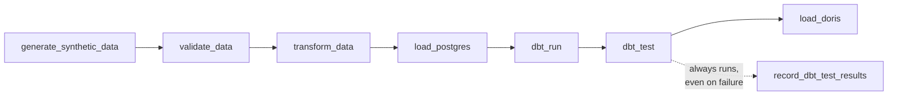

# Data Pipeline Flowchart

This doc walks through **the entire pipeline, step by step**, with a diagram
and a real code snippet for each stage. Think of it as "if you read only one
doc to understand how data moves through this project, read this one."

If you're new to data engineering: a pipeline like this is usually called
**ETL** (Extract, Transform, Load) or **ELT** (Extract, Load, Transform) —
the difference is just *when* the transformation happens relative to the
warehouse load. We're closer to ELT: we clean/transform with PySpark *before*
Postgres, but the actual **star-schema modeling** (turning staging tables
into dimension/fact tables) happens *inside* the warehouse via dbt, which is
the "T" happening after the "L" — the modern, dbt-flavored way of doing
things.

> ETL (Extract, Transform, Load) is a key process in data engineering that
> prepares raw data for analysis. It involves extracting data from one or
> more sources, transforming it into a clean and consistent format, and
> loading it into a place where it can be queried — a database, a warehouse,
> or a data lake.

---

## The big picture

```mermaid
flowchart TD
    KAGGLE[("Kaggle dataset\nreal restaurants")] -->|"01: one-time download"| RAWR["raw_restaurants.csv"]
    FAKE["Faker library"] -->|"02: daily generation"| RAWT["raw_customers/orders/\nitems/payments/deliveries.csv"]

    RAWR --> VAL{"04: Validate\n(business rules)"}
    RAWT --> VAL
    VAL -->|valid rows| TRANS["05: Transform\n(PySpark)"]
    VAL -->|invalid rows| REJ[("rejected_*.csv\n+ reason code")]

    TRANS --> CLEAN["clean_*.csv"]
    CLEAN --> LOADPG["06: Load to Postgres\n(staging tables)"]
    LOADPG --> PG[("PostgreSQL")]

    PG --> DBTRUN["07: dbt run\n(build star schema)"]
    DBTRUN --> DBTTEST["07: dbt test\n(37 data-quality checks)"]
    DBTTEST --> LOADDORIS["08: Load to Doris"]
    LOADDORIS --> DORIS[("Apache Doris")]

    DORIS --> METABASE["10: Metabase dashboards"]
    DORIS --> DASH["10b: Plotly Dash frontend\n(local, optional)"]
    PG --> DASH

    VAL -.-> HEALTH1[("pipeline_validation_runs")]
    DBTTEST -.-> HEALTH2[("pipeline_dbt_test_runs")]
    HEALTH1 --> METABASE
    HEALTH2 --> METABASE
    HEALTH1 -.-> DASH
    HEALTH2 -.-> DASH

    style REJ fill:#4a1f1f
    style HEALTH1 fill:#1f3a4a
    style HEALTH2 fill:#1f3a4a
```



Everything from **04 (Validate)** through **08 (Load to Doris)** runs
automatically, once a day, orchestrated by an Airflow DAG. Steps **01** and
**03** are one-time/manual — you run them yourself, once, before the daily
pipeline ever starts.

---

## Step 1 — Data Acquisition (`01_download_data.py`)

**One-time.** Downloads the real Kaggle dataset (Bangalore restaurants:
name, address, cuisines, rating, real customer reviews, etc.) once, and never
re-downloads it.

```python
def main():
    if TARGET_FILE.exists():
        print(f"Already downloaded: {TARGET_FILE}")
        return

    dataset_path = Path(kagglehub.dataset_download("rajeshrampure/zomato-dataset"))
    csv_files = list(dataset_path.glob("*.csv"))
    shutil.copy(csv_files[0], TARGET_FILE)
```

The `if TARGET_FILE.exists(): return` guard is the whole point of this being
"Step 1" and not part of the daily DAG — there's no reason to hit Kaggle's
servers every day for a dataset that never changes.

---

## Step 2 — Synthetic Data Generation (`02_generate_synthetic_data.py`)

**Runs daily.** The Kaggle dataset only has *restaurants* — no orders, no
customers, no deliveries. This script invents all of that with
[Faker](https://faker.readthedocs.io/), but not randomly: it anchors
synthetic order volume/value to each restaurant's *real* signals (rating,
vote count, cost-for-two) so a highly-rated, high-vote restaurant plausibly
gets more (and pricier) orders than an obscure one.

```python
restaurants["weight"] = (restaurants["votes"] + 1) * restaurants["rate_parsed"]
...
restaurant_id = rng.choices(restaurant_ids, weights=weights, k=1)[0]
order_total = round(cost_by_restaurant[restaurant_id] / 2 * party_size * rng.uniform(0.8, 1.2), 2)
```

This is a **weighted random choice** — `rng.choices(..., weights=weights)`
means a restaurant with double the "weight" is twice as likely to be picked
for a synthetic order. It's a simple trick, but it's what makes the fake
data *look* like real business data instead of pure noise.

The `--date` argument matters: it's how the same script simulates "one new
day" every time Airflow calls it (`{{ ds }}` in the DAG, see Step 9 below).

---

## Step 3 — Data Profiling (`03_profile_data.py`)

**One-time, manual.** Before writing a single validation rule, you need to
know *what's actually wrong* with the raw data — nulls, weird formats,
duplicate rows. This script just prints that information; it doesn't fix
anything.

```python
print("--- Null counts per column ---")
print(df.isnull().sum())

print("\n--- 'rate' column: non-numeric values ---")
print(df["rate"].dropna().unique()[:20])
```

This is the step most tutorials skip, but it's the reason the rules in Step
4 exist at all — e.g. discovering the `rate` column contains literal string
values like `"NEW"` and `"-"` (not just numbers) is exactly what tells you
to write a rule that treats those as nulls, instead of finding out the hard
way when a downstream `CAST` silently produces garbage.

---

## Step 4 — Data Validation (`04_validate_data.py`)

**Runs daily, and it's the pipeline's gatekeeper.** This is the single most
important step for **data quality**, front-loaded on purpose instead of
"we'll clean it up in the warehouse later" (a decision documented in
`CLAUDE.md` — a past project got burned by exactly that shortcut).

```python
def validate_orders(df, valid_restaurant_ids, valid_customer_ids):
    reasons = pd.Series("", index=df.index)
    reasons[df["order_total"] <= 0] = "non_positive_order_total"
    reasons[(reasons == "") & ~df["customer_id"].isin(valid_customer_ids)] = "orphan_customer_id"
    reasons[(reasons == "") & ~df["restaurant_id"].isin(valid_restaurant_ids)] = "orphan_restaurant_id"
    is_dup = df["order_id"].duplicated() & (reasons == "")
    reasons[is_dup] = "duplicate_order_id"
    is_valid = reasons == ""
    return split(df, is_valid, reasons)
```

Every row gets a `reason` string. Empty string = valid. Anything else =
**quarantined**, not silently dropped — it lands in `rejected_orders.csv`
with that exact reason attached, so you (or a future teammate) can actually
debug *why* something failed instead of just noticing "we're missing rows."

```python
if worst_rate > REJECTION_RATE_THRESHOLD:  # 2%
    sys.exit(1)
```

If more than 2% of any single table fails validation, the **whole pipeline
run fails loudly** here — bad data never reaches PySpark, Postgres, or Doris.
This is the "gate the pipeline on a rejection-rate threshold" requirement
from `CLAUDE.md`, in code.

---

## Step 5 — Data Transformation (`05_transform_data.py`, PySpark)

**Runs daily. This is where PySpark comes in.**

> PySpark lets you use Python to process and analyze large datasets that
> don't comfortably fit in memory on one machine. It runs the same code
> across multiple worker processes/machines, which is what makes big-data
> transformations fast. Typical uses: batch processing, SQL over distributed
> data, and (in bigger setups) streaming and ML at scale.

Our dataset here is small enough to run PySpark in **local mode** (one
machine, multiple *threads* rather than a real cluster) — but the code is
identical to what you'd write for a genuine multi-node cluster, which is the
whole point of learning it this way.

Three things happen in this step:

**1. Explicit schemas, never `inferSchema`** (see `CLAUDE.md`'s hard
constraint on this):

```python
RESTAURANT_SCHEMA = T.StructType([
    T.StructField("url", T.StringType()),
    T.StructField("votes", T.StringType()),
    ...
])
df = spark.read.option("header", True).schema(RESTAURANT_SCHEMA).csv(path)
```

Letting Spark *guess* a schema is fast to write but dangerous — a guess made
from a sample of rows can silently misjudge a column's type, and you won't
find out until a later stage crashes or (worse) produces wrong numbers.

**2. Exploding `cuisines` into a many-to-many relationship:**

```python
F.explode(F.split(F.coalesce(F.col("cuisines"), F.lit("")), r",\s*"))
```

A restaurant like `"North Indian, Chinese"` needs to become **two rows** —
one per cuisine — so it can be queried and joined later. `explode()` is the
Spark function for exactly this: turning one row with an array into many
rows, one per array element.

**3. Parsing real review text out of a stringified Python list:**

```python
def parse_reviews(reviews_str):
    tuples = ast.literal_eval(reviews_str)
    return [{"review_rating": ..., "review_text": ...} for rating_str, text in tuples]

parse_reviews_udf = F.udf(parse_reviews, REVIEW_ARRAY_SCHEMA)
```

The Kaggle `reviews_list` column is a *string* that looks like a Python
list of tuples — `"[('4.0', 'RATED Nice place'), ...]"`. A **UDF**
(User-Defined Function — your own Python function, registered so Spark can
call it row by row) is how you handle a parsing job that doesn't map to any
built-in Spark function.

> **Gotcha worth knowing:** `.toPandas()` (converting a huge Spark
> DataFrame to a pandas one) was originally used to write every output file,
> but doing that for the 1.3M-row reviews table roughly *doubles* memory use
> — the data briefly exists as both JVM objects and Python objects at once.
> That crashed the Spark JVM under memory pressure. The fix
> (`write_csv_native`) writes straight from Spark's own CSV writer instead,
> so the data never has to leave the JVM. See `doc/WALKTHROUGH.md` and the
> README's Known Issues section for the full story.

---

## Step 6 — Load to Staging (`06_load_postgres.py`)

**Runs daily.** Takes the `clean_*.csv` files from Step 5 and bulk-loads
them into Postgres as `stg_*` tables — a straightforward relational
"staging area" that dbt will read from next.

```python
copy_sql = f"COPY {table_name} ({', '.join(columns)}) FROM STDIN WITH (FORMAT csv, HEADER true, NULL '')"
cur.copy_expert(copy_sql, f)
```

**Why `COPY` and not `INSERT`?** This project originally used
`psycopg2.extras.execute_values` (a batched `INSERT`), and loading the
1.3-million-row reviews table took **20+ minutes**. Switching to Postgres's
native `COPY` command — designed specifically for bulk-loading a file
straight into a table — brought the *entire* load (all 8 tables) down to
**6.6 seconds**. Lesson: for bulk loading, always reach for your database's
native bulk-load command before hand-rolling batched inserts.

Every table is `DROP`ped and recreated on every run — this is an **ELT**
mindset: staging always mirrors *today's* clean data exactly; there's no
attempt to "merge" or "upsert" here, because dbt (next step) is what does
the durable, versioned modeling.

---

## Step 7 — Data Modeling (`dbt_project/`)

**Runs daily.** This is where raw staging tables become an actual **star
schema** — dimension tables (`dim_restaurant`, `dim_customer`, `dim_date`,
...) and fact tables (`fact_orders`, `fact_reviews`, ...), the standard
shape for anything meant to be queried by a BI tool.

```sql
-- models/facts/fact_orders.sql
select
    o.order_id,
    o.customer_id,
    o.restaurant_id,
    r.location_id,
    o.order_date as date_id,
    o.order_hour as hour_id,
    o.party_size,
    o.order_total,
    o.order_status
from {{ source('staging', 'stg_orders') }} o
left join {{ ref('dim_restaurant') }} r on r.restaurant_id = o.restaurant_id
```

`{{ source(...) }}` and `{{ ref(...) }}` are **dbt Jinja macros** — dbt
compiles this template into real SQL, and (more importantly) uses these
references to build a **dependency graph**, so it knows to build
`dim_restaurant` before `fact_orders` automatically. You never write
`CREATE TABLE` or manage build order by hand.

```bash
dbt run   # builds every model as a real table, in dependency order
dbt test  # runs every check in schema.yml against the tables dbt just built
```

`dbt test` is where 37 checks run — `not_null` and `unique` on every primary
key, `relationships` (foreign-key existence) on every dimension reference:

```yaml
- name: restaurant_id
  data_tests:
    - relationships:
        to: ref('dim_restaurant')
        field: restaurant_id
```

This is dbt's built-in replacement for what you'd otherwise write by hand as
a `SELECT COUNT(*) FROM fact_orders WHERE restaurant_id NOT IN (SELECT
restaurant_id FROM dim_restaurant)` — same idea, much less boilerplate.

---

## Step 8 — Load to Warehouse (`08_load_doris.py`)

**Runs daily.** Copies the finished star schema out of Postgres and into
**Apache Doris** — the database that actually serves the BI dashboard.

Why not just point Metabase at Postgres directly and skip Doris entirely?
Because Postgres is a row-oriented OLTP database — great at reading/writing
single rows, not built for scanning millions of rows to compute aggregates.
Doris is a **column-oriented OLAP** database, purpose-built for exactly the
kind of `GROUP BY`/`SUM`/`COUNT` queries a dashboard fires constantly. This
project uses Doris specifically because it's free/self-hosted and speaks the
MySQL wire protocol (so any MySQL-compatible tool, including Metabase, works
with it out of the box) — see `CLAUDE.md` for why it was picked over
Snowflake.

```python
resp = requests.put(
    f"http://{DORIS_HOST}:{DORIS_STREAM_LOAD_PORT}/api/{DORIS_DB}/{table_name}/_stream_load",
    data=f,  # the CSV file, streamed
    auth=(DORIS_USER, DORIS_PASSWORD),
    headers={"format": "csv", "column_separator": ",", "enclose": '"'},
)
```

**Stream Load** is Doris's own bulk-ingest HTTP API — same idea as
Postgres's `COPY` in Step 6: row-by-row `INSERT` is an anti-pattern for an
OLAP engine, so we stream the whole file in one HTTP request instead.

---

## Step 9 — Orchestration (`09_dag.py`, Apache Airflow)

**This is what actually runs Steps 2 and 4–8, automatically, once a day.**
Everything above this line is just Python/SQL scripts that *can* run
standalone — Airflow is what turns them into a real, scheduled pipeline.

```python
with DAG(dag_id="zomato_analytics_pipeline", schedule="@daily", catchup=False) as dag:
    generate_synthetic_data = BashOperator(task_id="generate_synthetic_data", ...)
    validate_data = BashOperator(task_id="validate_data", ...)
    ...
    (
        generate_synthetic_data
        >> validate_data
        >> transform_data
        >> load_postgres
        >> dbt_run
        >> dbt_test
        >> load_doris
    )
    dbt_test >> record_dbt_test_results
```

- **`DAG`** stands for **Directed Acyclic Graph** — a fancy way of saying
  "a set of steps with dependencies, and no step depends on itself, directly
  or in a loop." Every workflow orchestrator (Airflow, Dagster, Prefect) is
  built around this idea.
- **`>>`** is Airflow's own operator overload for "this task must finish
  before that one starts." Reading the code above top to bottom *is* reading
  the pipeline's execution order.
- **`BashOperator`** just runs a shell command — in our case, `python
  <script>.py`. Airflow doesn't care that the "real work" is Python; from
  its point of view every task is "run this command and tell me if it
  exits 0."
- Notice `dbt_test >> record_dbt_test_results` is a **separate branch**,
  not chained after `load_doris`. That's deliberate: recording the pipeline's
  health (Step 11) has `trigger_rule="all_done"`, meaning it runs *even if
  `dbt_test` fails* — so a bad run shows up on the Pipeline Health dashboard
  instead of just silently not updating it. `load_doris`, on the other hand,
  should **not** run if tests failed — that's the actual data-quality gate.



---

## Step 10 — Visualization (Metabase)

**Always-on**, not a pipeline step that "runs" — Metabase just reads
whatever is currently in Doris and Postgres, live, whenever someone opens a
dashboard. See `doc/DASHBOARD.md` for a full breakdown of every chart.

## Step 10b — Alternative Visualization (`10_dash_dashboard.py`, Plotly Dash)

**Optional, local-only, manually started.** A second frontend on top of the
exact same Doris/Postgres tables Metabase reads — built with
[Dash](https://dash.plotly.com/), Plotly's Python framework for building
web apps without writing any JavaScript.

```python
app = Dash(__name__, external_stylesheets=[
    "https://fonts.googleapis.com/css2?family=Poppins:wght@400;500;600;700;800&display=swap"
])

app.layout = html.Div([SIDEBAR, html.Div([TOPBAR, html.Div(id="tab-content")])])

@app.callback(Output("tab-content", "children"), Input("tabs", "value"))
def render_tab(tab_value):
    return render_section(SECTIONS[tab_value])
```

A few things worth noticing if you're new to Dash:

- **`dcc.Tabs(vertical=True)`** is what turns Dash's normal horizontal tab
  bar into the vertical sidebar nav seen in the screenshots — same
  component, one prop flipped.
- **`@app.callback`** is Dash's core idea: wiring an `Input` (here, which
  sidebar tab is selected) to an `Output` (the page content) via a plain
  Python function. No page reload — Dash swaps the HTML for you under the
  hood using React internally, even though you never write any JS.
- Data (`SECTIONS = fetch_all_sections()`) is fetched **once, at startup**,
  not per click — this dashboard is a quick local snapshot, not a
  live-refreshing one. Re-run the script to pick up new data.
- Styling (brand colors, the `assets/zomato_logo.svg` logo, the Poppins
  font) is plain Python dicts passed as inline `style=` props, plus Dash's
  `assets/` folder convention (anything dropped in `assets/` is
  auto-served at `/assets/...`, which is how the logo file is referenced).

Run it with `pip install dash plotly && python 10_dash_dashboard.py`, then
open `http://127.0.0.1:8050`. See `doc/DASHBOARD.md` for what the branding
looks like and `doc/WALKTHROUGH.md` step 13 for the exact commands.

## Step 11 — Monitoring (`04_validate_data.py` + `07_record_dbt_test_results.py`)

**Passive, runs as a side-effect of Steps 4 and 7.** Every pipeline run
appends one row to `pipeline_validation_runs` (rejection counts/rate) and one
row to `pipeline_dbt_test_runs` (dbt pass/fail counts) in Postgres. Metabase's
Pipeline Health page reads these two tables directly — this is what lets you
answer "did last night's run actually work?" without SSHing into a server
and reading log files.

---

## Where to look next

- **`doc/WALKTHROUGH.md`** — the exact commands to run every step above
  yourself, in order.
- **`doc/DASHBOARD.md`** — what every chart on the resulting dashboard means.
